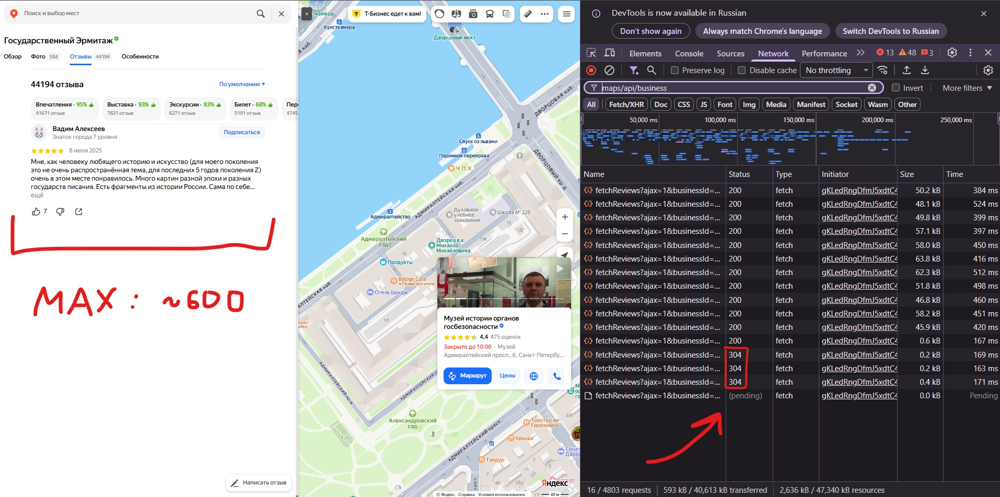

# Imtera parser

## Структура монорепо

```
imtera-parser/
  backend/
    app/Http/Controllers/
    app/Services/            # YandexMapsParser — HTTP-клиент к scraper
    app/DTO/                 # маппинг JSON-ответа scraper в типизированные объекты
    database/migrations/
  frontend/         
  scraper/                   # Node.js + Playwright микросервис (POST /scrape)
  services/                  # Docker-конфиги (nginx, php, mysql, npm, scraper)
  docker-compose.yml
```

## Развёртывание через Docker

Вся инструкция (включая настройку переменных среды) находится здесь: <a href="./DEPLOY.md">DEPLOY.md</a>

## Подход к парсингу и обходу защиты

У Яндекс.Карт нет официального API для отзывов сторонних организаций. Запрос, которым сама
страница подгружает отзывы (`fetchReviews`), требует подписи `s` — её на лету считает
обфусцированный JS прямо в браузере, без неё Яндекс отвечает `400`. Разбирать этот алгоритм
отдельно — долго и ненадёжно: сломается при первом же обновлении фронтенда Яндекса.

Поэтому вместо прямых запросов используется **headless-браузер** (Playwright + Chromium):
сервис открывает страницу организации как обычный пользователь, скроллит список отзывов и
просто слушает сетевые ответы, которые в этот момент делает сама страница. Подпись считает и
подставляет сама страница Яндекса — реверсить ничего не нужно.

Коротко, что происходит при скрейпе одной организации:

1. Любая ссылка на организацию (карточка, попап на карте, разные локали) приводится к одному
   виду — `.../maps/org/-/<id>/reviews/`.
2. Браузер открывает страницу и ждёт, пока появится список отзывов. Если за 15 секунд не
   появился — считаем, что организация не найдена.
3. Первые ~50 отзывов уже лежат прямо в HTML страницы при загрузке (засчёт SSR) — забираем их сразу, без
   скролла.
4. Средний рейтинг и счётчики читаются из разметки страницы. У части организаций (без общей
   оценки — например, у парков и вокзалов) этого блока нет вовсе — тогда сохраняем `null`,
   а не считаем это ошибкой: страница и отзывы на ней настоящие.
5. Дальше сервис скроллит список вниз и каждый раз ждёт новый ответ `fetchReviews`, пока не
   соберёт нужное число отзывов или пока список не закончится.
6. Если сеть оборвалась раньше, чем дошли до конца списка — возвращаем ошибку, а не отдаём
   часть данных под видом полного результата.

Известное ограничение: сам Яндекс на практике не отдаёт больше ~600 отзывов на одну
организацию — это его лимит, мы тут ничего сделать не можем.

Отдельно настроена производительность: контейнер со scraper ограничен по CPU и памяти, а
загрузка картинок и шрифтов отключена — данные и так приходят в виде JSON, рендерить страницу
целиком не нужно. Без этих ограничений headless-браузер мог забрать себе все ресурсы хоста.

### Как это собрано вместе

Laravel сам ссылку не парсит и не валидирует — этим целиком занимается scraper. `POST
/api/settings` синхронно (без очереди — это инструмент на одного пользователя, поэтому
можно просто подождать) дёргает scraper, получает готовые данные и сохраняет их в БД. Пока
идёт запрос, фронтенд просто показывает, сколько секунд прошло, без polling. Если scraper
вернул ошибку — её текст прокидывается на фронтенд как есть, а не общим "что-то пошло не так".

Дальше отзывы отдаются постранично прямо из БД (по 50 на страницу), без повторных обращений
к Яндексу. Если организация уже подключена — повторное подключение (та же ссылка или тот же
id организации под другой ссылкой) вернёт ошибку, а не запустит скрейп заново.

## Что бы я добавил (или пофиксил)

### Интеграция с ИИ (ключевая фишка Laravel 13)

```php
/**
 * Простенький пример интеграции:
 * по собранным отзывам ИИ генерирует
 * автоответы от лица компании.
 */

namespace App\Http\Controllers;

use App\Ai\Agents\ReviewsCoach;
use App\Models\Review;

class AutoReplyController extends Controller
{
  public function generateReplies()
  {
    Review::whereNull('business_comment')->chunk(100, function ($reviews) {
      foreach ($reviews as $review) {
        $reply = ReviewsCoach::make()
          ->prompt(
            "Напиши вежливый и краткий ответ от лица компании
            на этот отзыв (оценка {$review->rating}/5):
            {$review->text}"
          )
          ->text();

        $review->update(['business_comment' => $reply]);
      }
    });

    return response()->json(['status' => 'done']);
  }
}
```

Но зависит, конечно, с какой целью собираются отзывы: если аналитика, то и под неё можно подстроить запросы нейронке.

### Хранение большего количества метаданных

В моделях `Organization` и `Review` часть полей сейчас "сплющена" в строки: например, у
Яндекса ответ организации на отзыв — это объект, а не просто текст, то же самое с данными
об авторе. Сохраняем только то, что реально выводим на экран — а ещё нигде не храним
количество лайков на отзыве.

### Асинхронный скрейп вместо синхронного ожидания

Сейчас `POST /api/settings` держит HTTP-запрос открытым на всё время скрейпа (1–2 минуты), а
фронтенд просто считает секунды. Правильнее — вынести скрейп в фоновую Laravel-задачу:
эндпоинт сразу отвечает, организация получает статус `pending`, а фронтенд опрашивает его,
пока тот не станет `done`/`failed`. Заодно стоит добавить кнопку "Повторить подключение" — на
случай, если первая попытка сорвалась.

### Что делать с прерванными скрейпами

Если скрейп прервался на середине (например, "собрано 99 из 500 отзывов" из-за сетевого
сбоя), сейчас это просто ошибка без данных. Стоит дать пользователю возможность повторить
именно эту попытку, не теряя то, что уже успели собрать.

### Лимит в ~600 отзывов

Сам Яндекс не отдаёт больше — это его ограничение, обойти которое пока не вышло:



### Progress-bar вместо счётчика секунд

Зная общее число отзывов организации и сколько уже собрано, можно прикинуть, сколько скрейп
ещё займёт — например, до 50 отзывов в среднем уходит 3–5 секунд, до 100 — около 6, и так
далее. Сейчас вместо этого просто крутится счётчик прошедшего времени.

### Переиспользование браузера между запросами

Сейчас каждый `/scrape`-запрос запускает новый `chromium.launch()` и полностью закрывает
браузер по завершении — это даёт CPU-всплеск на старте каждого запроса. Можно держать один
прогретый браузер между запросами и просто открывать/закрывать страницы.

Не сделал осознанно: для одного пользователя с редкими запросами выигрыш маржинальный, а
добавляется сложность жизненного цикла (что делать, если браузер упал или завис между
запросами) — ровно та сложность, от которой я отказался, выбрав синхронную модель без
очереди.

### У отзывов нет аватаров

Headless-браузер больше их не рендерит — загрузку картинок отключили ради производительности.

### Поиск по названию или id

Добавить в интерфейс поисковую строку, фильтрацию и сортировку организаций.

### Почему нет кэширования отзывов на бэке

Отзывы и так отдаются постранично (по 50 штук), а организаций пока немного — кэшировать
результат на уровне БД смысла не было: выигрыш в скорости небольшой, а сложности с
инвалидацией кэша при новом скрейпе перевешивают пользу.
